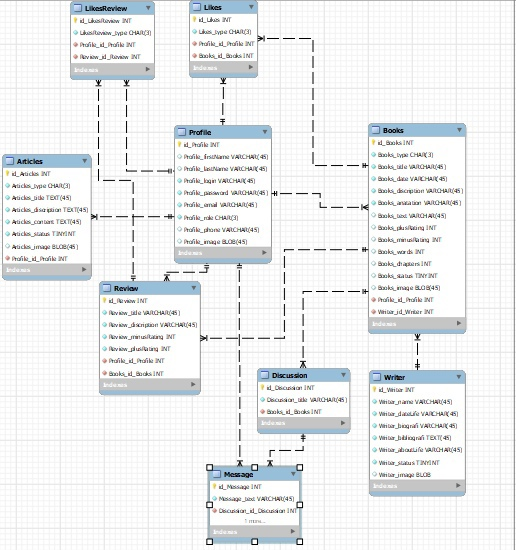
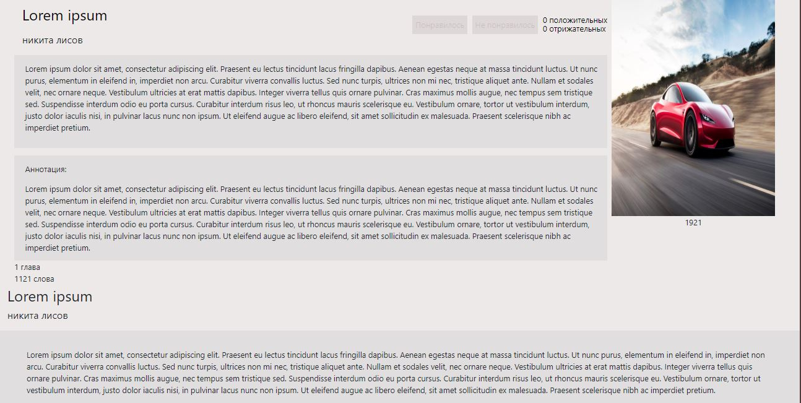

# Проект по учебной практике 11.01

## Общее описание проекта

  Сервис, где пользователи могут выкладывать книги, статьи, оценивать их, создавать рецензии и дискуссии.

## Схема базы данных
  <figure>
    
    <figcaption>
      Таблица Articles - таблица со статьями
       
      Таблица Profile - таблица с профилями
       
      Таблица Review - таблица с рецензиями
       
      Таблица Books - таблица с книгами
       
      Таблица Discussion - таблица с дискуссиями
       
      Таблица Writer - таблица с авторами
       
      Таблица Message - таблица с сообщениями в дискуссии
       
      Таблица Likes - таблица с лайками для книги
       
      Таблица LikesReview - таблица с лайками для рецензий
    </figcaption>
  </figure>

## Описание каждой таблицы

####Таблица Articles
  Эта таблица описывает модель статей

      class Articles(models.Model):
          HISTORY = 'HIS'
          LITER = 'LIT'
          ARTICLE_PERMISSION_CHOICES = [
              (HISTORY, 'Историческая'),
              (LITER, 'Литературная'),
          ]
          type = models.CharField(
              max_length=3,
              choices=ARTICLE_PERMISSION_CHOICES,
              verbose_name="Тип"
          )
          article_title = models.TextField(verbose_name="Название")
          discription = models.TextField(verbose_name="Описание")
          content = models.TextField(verbose_name="Содержимое")
          status = models.BooleanField(default=False, verbose_name="Статус")
          image = models.ImageField(blank=True, null=True, upload_to=generate_imageset_upload_to)
          user = models.ForeignKey(User, on_delete=models.CASCADE, verbose_name="Создатель")

          class Meta:
              verbose_name = "Статья"
              verbose_name_plural = "Статьи"

          def __str__(self):
              return self.article_title

  Поле type - поле с типом статьи. Статьи делятся на "Исторические" и "Литературные".
   
  Поле article_title - поле с названием статьи.
   
  Поле discription - поле с описанием статьи.
   
  Поле content - поле с содержанием статьи.
   
  Поле status - поле статуса статьи. Пользователи видят статьи, у который поддтвержденный статус. Статус меняет администратор.
   
  Поле image - поле для обложки статьи. Это поле необязательно для заполнения.
   
  Поле user - поле, которое адресует на пользонателя, который создал эту статью.

####Таблица Profile  
  Эта таблица описывает модель профиля

        class Profile(models.Model):
            ADMIN = 'ADM'
            CLIENT = 'CLI'
            USER_PERMISSION_CHOICES = [
                (ADMIN, 'Админ'),
                (CLIENT, 'Пользователь'),
            ]
            role = models.CharField(
                max_length=3,
                choices=USER_PERMISSION_CHOICES,
                default=CLIENT
            )
            user = models.OneToOneField(User, on_delete=models.CASCADE)
            phone = models.TextField(max_length=12, blank=True)
            image = models.ImageField(blank=True, null=True, upload_to=generate_imageset_upload_to)

            class Meta:
                verbose_name = 'Профиль'
                verbose_name_plural = 'Профили'

            def __str__(self):
                return self.user.username

  Поле role - поле с типом пользователя. Пользователи делятся на "Администратор" и "Пользователь".
   
  Поле user - поле, которое адресует на пользонателя.
   
  Поле phone - поле с номером телефона.
   
  Поле image - поле для аватарки пользователя. Это поле необязательно для заполнения.

####Таблица Writer  
  Эта таблица описывает модель писателя

      class Writer(models.Model):
          name = models.TextField(verbose_name="Имя")
          date_life = models.TextField(verbose_name="Даты жизни")
          biografi = models.TextField(verbose_name="Биография")
          bibliografi = models.TextField(verbose_name="Библиография")
          about_life = models.TextField(verbose_name="Произведения о жизни")
          status = models.BooleanField(default=False, verbose_name="Статус")
          image = models.ImageField(blank=True, null=True, upload_to=generate_imageset_upload_to)

          class Meta:
              verbose_name = "Писатель"
              verbose_name_plural = "Писатели"

          def __str__(self):
              return self.name

  Поле name - поле с именем писателя.
   
  Поле date_life - поле для даты жизни.
   
  Поле biografi - поле для биографии писателя.
   
  Поле about_life - поле для произведений, которые описывают жизнь автора.
   
  Поле status - поле для статуса писателя.
   
  Поле image - поле фотографии писателя. Это поле необязательно для заполнения.

####Таблица Books  
  Эта таблица описывает модель книги

    class Books(models.Model):
        BOOK = 'DEF'
        PROSE = 'PRS'
        BOOK_PERMISSION_CHOICES = [
            (BOOK, 'Книги'),
            (PROSE, 'Проза'),
        ]
        type = models.CharField(
            max_length=3,
            choices=BOOK_PERMISSION_CHOICES,
            verbose_name="Тип"
        )
        author = models.ForeignKey(Writer, on_delete=models.CASCADE, verbose_name="Создатель")
        title = models.TextField(verbose_name="Название")
        date = models.TextField(blank=True, null=True, verbose_name="Дата написания")
        discription = models.TextField(verbose_name="Описание")
        anatation = models.TextField(verbose_name="Аннотация")
        text = models.TextField(blank=True, null=True, verbose_name="Текст")
        plus_rating = models.IntegerField( verbose_name="Положительный рейтинг")
        words = models.IntegerField(blank=True, null=True, verbose_name="Количество слов")
        chapters = models.IntegerField(blank=True, null=True, verbose_name="Количество глав")
        minus_rating = models.IntegerField( verbose_name="Отрицательный рейтинг")
        status = models.BooleanField(default=False, verbose_name="Статус")
        image = models.ImageField(blank=True, null=True, upload_to=generate_imageset_upload_to)

        user = models.ForeignKey(User, on_delete=models.CASCADE, verbose_name="Создатель")

        class Meta:
            verbose_name = "Книга"
            verbose_name_plural = "Книги"

        def __str__(self):
            return self.title

  Поле type - поле с типом книги. Статьи делятся на "Книги" и "Проза".
   
  Поле author - поле, которое адресует на автора этой книги.
   
  Поле title - поле с названием книги.
   
  Поле date - поле с датой написания.
   
  Поле discription - поле с описанием книги.
   
  Поле text - поле с содержимом книги. Это поле необязательно для заполнения.
   
  Поле plus_rating - поле с положительным рейтингом.
   
  Поле words - поле с количеством слов. Это поле необязательно для заполнения.
   
  Поле chapters - поле с количеством глав. Это поле необязательно для заполнения.
   
  Поле minus_rating - поле с отрицательным рейтингом.
   
  Поле status - поле статуса книги. Пользователи видят книги, у который поддтвержденный статус. Статус меняет администратор.
   
  Поле image - поле с обложкой книги.
   
  Поле user - поле, которое адресует на пользователя, который создал книгу.

####Таблица Review  
  Эта таблица описывает модель рецензии

      class Review(models.Model):
          user = models.ForeignKey(User, on_delete=models.CASCADE, verbose_name="Создатель")
          book = models.ForeignKey(Books, on_delete=models.CASCADE, verbose_name="Книга")
          title = models.TextField(verbose_name="Название")
          discription = models.TextField(verbose_name="Описание")
          minus_rating = models.IntegerField( verbose_name="Отрицательный рейтинг")
          plus_rating = models.IntegerField( verbose_name="Положительный рейтинг")

          class Meta:
              verbose_name = "Рецензия"
              verbose_name_plural = "Рецензии"

          def __str__(self):
              return self.title

  Поле book - поле, которое адресует на книгу, к которой создана рецензия.
   
  Поле title - поле с названием рецензии.
   
  Поле discription - поле с описанием рецензии.
   
  Поле plus_rating - поле с положительным рейтингом.
   
  Поле minus_rating - поле с отрицательным рейтингом.
   
  Поле user - поле, которое адресует на пользователя, который создал рецензию.

####Таблица Discussion  
  Эта таблица описывает модель дискуссий

      class Discussion(models.Model):
          title = models.TextField(verbose_name="Название")
          book = models.ForeignKey(Books, on_delete=models.CASCADE, verbose_name="Книга")

          class Meta:
              verbose_name = "Дискуссия"
              verbose_name_plural = "Дискуссии"

          def __str__(self):
              return self.title

  Поле book - поле, которое адресует на книгу, к которой создана дискуссия.
   
  Поле title - поле с названием дискуссии.

####Таблица Message  
  Эта таблица описывает модель сообщений

    class Message(models.Model):
        user = models.ForeignKey(User, on_delete=models.CASCADE, verbose_name="Создатель")
        discussion = models.ForeignKey(Discussion, on_delete=models.CASCADE, verbose_name="Тема дискуссии")
        text = models.TextField(blank=True, null=True, verbose_name="Текст")

        class Meta:
            verbose_name = "Сообщение"
            verbose_name_plural = "Сообщения"

        def __str__(self):
            return self.text

  Поле discussion - поле, которое адресует на дискуссию, к которой создано сообщение.
   
  Поле text - поле с содержимом сообщения.
   
  Поле user - поле, которое адресует на пользователя, который написал сообщение.

####Таблица Likes  
  Эта таблица описывает модель лайков книг

    class Likes(models.Model):
        LIK = 'LIK'
        DIS = 'DIS'
        LIKES_PERMISSION_CHOICES = [
            (LIK, 'Лайк'),
            (DIS, 'Дислайк'),
        ]
        type = models.CharField(
            max_length=3,
            choices=LIKES_PERMISSION_CHOICES,
            verbose_name="Тип"
        )
        user = models.ForeignKey(User, on_delete=models.CASCADE, verbose_name="Создатель")
        book = models.ForeignKey(Books, on_delete=models.CASCADE, verbose_name="Книга")

        class Meta:
            verbose_name = "Лайк"
            verbose_name_plural = "Лайки"

        def __str__(self):
            return self.type

  Поле book - поле, которое адресует на книгу, которой поставлена оценка.
   
  Поле type - поле с типом оценки. Оценки делятся на "Лайки" и "Дислайки"
   
  Поле user - поле, которое адресует на пользователя, который поставил оценку.

###Таблица LikesReview  
  Эта таблица описывает модель лайков рецензий

    class LikesReview(models.Model):
        LIK = 'LIK'
        DIS = 'DIS'
        LIKES_PERMISSION_CHOICES = [
            (LIK, 'Лайк'),
            (DIS, 'Дислайк'),
        ]
        type = models.CharField(
            max_length=3,
            choices=LIKES_PERMISSION_CHOICES,
            verbose_name="Тип"
        )
        user = models.ForeignKey(User, on_delete=models.CASCADE, verbose_name="Создатель")
        review = models.ForeignKey(Review, on_delete=models.CASCADE, verbose_name="Статья")

        class Meta:
            verbose_name = "Лайк рецензии"
            verbose_name_plural = "Лайки рецинзий"

        def __str__(self):
            return self.type

  Поле review - поле, которое адресует на рецензию, которой поставлена оценка.
   
  Поле type - поле с типом оценки. Оценки делятся на "Лайки" и "Дислайки"
   
  Поле user - поле, которое адресует на пользователя, который поставил оценку.

## Описание страниц
 Адресация страниц представлена ниже.

     urlpatterns = [
         path('', views.index),
         path('accounts/', include('django.contrib.auth.urls'), {'next_page': '/'}),
         path('books/', views.books),
         path('articles/', views.articles),
         path('writer/<int:pk>/', views.writer.as_view()),
         path('read_one_review/<int:pk>/', views.read_one_review.as_view()),
         path('discussion/<int:pk>/', views.discussion.as_view()),
         path('read_book/<int:pk>/', views.read_book.as_view()),
         path('read_article/<int:pk>/', views.read_article.as_view()),
         path('admin_dev/', views.admin_dev),
         path('password_recovery/', views.password_recovery),
         path('profile/', views.profile),
         path('profile_edit/', views.profile_edit),
         path('create_author/', views.create_author),
         path('article_confirmation/', views.article_confirmation),
         path('admin_create_composition/', views.admin_create_composition),
         path('confirmation_works/', views.confirmation_works),
         path('creat_composition/', views.creat_composition),
         path('create_article/', views.create_article),
         path('create_discussion/', views.create_discussion),
         path('create_rewies/', views.create_rewies),
         path('read_one_book/<int:pk>/', views.read_one_book.as_view()),
     ]

####Страница по ссылке '/'
  По адресу '/' распологается главная страница.
   
  За эту страницу отвечает функция index.

        def index(request):
            article = Articles.objects.all()
            books = Books.objects.all()
            context = {'article':article, 'books':books}
            if request.method == 'POST':
                data = request.POST

                if data.get("register"):
                    user = User.objects.create_user(data.get('login'), data.get('email'), data.get('password'))
                    # user.profile.phone = data.get('phone')
                    user.save()

                if data.get("enter"):
                    print(data)
                    user = authenticate(request, username=data.get('login'), password=data.get('password'))
                    if user is not None:
                        login(request, user)
                    else:
                        # context = {'error': "Неправильные параметры входа. Проверьте логин и пароль."}
                        print("Неправильные параметры входа. Проверьте логин и пароль.")
                        # return render(request, 'main/index.html', context)

                if data.get("search"):
                    books = Books.objects.filter(title = data.get('search'))
                    article = Articles.objects.filter(article_title = data.get('search'))
                    context['books'] = books
                    context['article'] = article
                    print(data)

            return render(request, 'main/index.html', context)

Эта функция передает в шаблон(index.html) книги(Books) и статьи(Articles). Также эта функция обрабатывает события поиска, регистрации и авторизации.

  
  

####Страница по ссылке 'accounts/'
  По адресу 'accounts/' показывается шапка сайта если пользователь авторизован.
   

  

####Страница по ссылке 'books/'
  По адресу 'books/' распологается страница с книгами.
   
  За эту страницу отвечает функция books.

      def books(request):
          books = Books.objects.all()
          context = {'books':books}
          if request.method == 'POST':
              data = request.POST
              if data.get('rating'):
                  books = Books.objects.order_by('-plus_rating')
                  context['books'] = books
                  print(data)
              if data.get('name'):
                  books = Books.objects.order_by('title')
                  context['books'] = books
                  print(data)
              if data.get('search_book'):
                  books = Books.objects.filter(title = data.get('search_book'))
                  context['books'] = books
                  print(data.get('search_book'))
          return render(request, 'main/books.html',  context)

Эта функция передает в шаблон(books.html) книги(Books). Также эта функция обрабатывает события поиска.

  

####Страница по ссылке 'articles/'
  По адресу 'articles/' распологается страница со статьями.
   
  За эту страницу отвечает функция articles.

      def articles(request):
          article = Articles.objects.all()
          context = {'article':article}
          if request.method == 'POST':
              data = request.POST
              if data.get('name'):
                  article = Articles.objects.order_by('article_title')
                  context['article'] = article
                  print(data)
              if data.get('search_article'):
                  article = Articles.objects.filter(article_title = data.get('search_article'))
                  context['article'] = article
                  print(data.get('search_article'))
          return render(request, 'main/articles.html', context)

Эта функция передает в шаблон(articles.html) статьи(Articles). Также эта функция обрабатывает события поиска.

  

####Страница по ссылке 'writer/'
  По адресу 'writer/' распологается страница с автором.
   
  За эту страницу отвечает класс writer.

      class writer(View):
          template_name = 'main/writer.html'

          def get(self, request, *args, **kwargs):
              writer = get_object_or_404(Writer, pk=kwargs['pk'])
              rewies = Review.objects.all()
              discussion = Discussion.objects.all()
              data = {'writer':writer}
              return render(request, self.template_name, context=data)

Этот класс передает в шаблон(writer.html) писателей(Writer). Этот класс позволяет выводить писателей через их PrimaryKey.

  

####Страница по ссылке 'read_one_review/'
  По адресу 'read_one_review/' распологается страница с рицензии.
   
  За эту страницу отвечает класс read_one_review.

      class read_one_review(View):
          template_name = 'main/read_one_review.html'

          def get(self, request, *args, **kwargs):
              review = get_object_or_404(Review, pk=kwargs['pk'])
              likes = LikesReview.objects.all()
              context = {'review': review, 'likes': likes}
              return render(request, self.template_name, context)

          def post(self, request, *args, **kwargs):
              review = get_object_or_404(Review, pk=kwargs['pk'])
              likes = LikesReview.objects.all()
              context = {'review':review, 'likes': likes}
              data = request.POST
              print(data)
              if request.POST.get('like'):
                  like = LikesReview.objects.get(id=data.get('like'))
                  like.type = 'LIK'
                  like.save()
                  review = Review.objects.get(id=data.get('like_input'))
                  review.plus_rating += 1
                  review.minus_rating -= 1
                  review.save()
              if request.POST.get('like2'):
                  like = LikesReview()
                  like.type = 'LIK'
                  like.user = User.objects.get(id=request.user.id)
                  like.review = Review.objects.get(id=data.get('like2'))
                  like.save()
                  review = Review.objects.get(id=data.get('like2'))
                  review.plus_rating += 1
                  review.save()
              if request.POST.get('dislike'):
                  like = LikesReview.objects.get(id=data.get('dislike'))
                  like.type = 'DIS'
                  like.save()
                  review = Review.objects.get(id=data.get('dislike_input'))
                  review.plus_rating -= 1
                  review.minus_rating += 1
                  review.save()
              if request.POST.get('dislike2'):
                  like = LikesReview()
                  like.type = 'DIS'
                  like.user = User.objects.get(id=request.user.id)
                  like.review = Books.objects.get(id=data.get('dislike2'))
                  like.save()
                  review = Review.objects.get(id=data.get('dislike2'))
                  review.minus_rating += 1
                  review.save()
              return render(request, self.template_name, context)

Этот класс передает в шаблон(read_one_review.html) дискуссии(Review) и лайки(LikesReview). Этот класс позволяет выводить рицензии через их PrimaryKey и реазизована система оценивания.

  

####Страница по ссылке 'discussion/'
  По адресу 'discussion/' распологается страница с дискуссией.
   
  За эту страницу отвечает класс discussion.

      class discussion(View):
          template_name = 'main/discussion.html'

          def get(self, request, *args, **kwargs):
              discussion = get_object_or_404(Discussion, pk=kwargs['pk'])
              messages = Message.objects.all()
              paginator = Paginator(messages, 2)
              page = self.request.GET.get('page')
              try:
                  messages = paginator.page(page)
              except PageNotAnInteger:
                  # Если страница не является целым числом, поставим первую страницу  
                  messages = paginator.page(1)
              except EmptyPage:
                  # Если страница больше максимальной, доставить последнюю страницу результатов
                  messages = paginator.page(paginator.num_pages)
              context = {'discussion': discussion, 'message':messages}
              return render(request, self.template_name, context)
          def post(self, request, *args, **kwargs):
              discussion = get_object_or_404(Discussion, pk=kwargs['pk'])
              messages = Message.objects.all()
              paginator = Paginator(messages, 2)
              page = self.request.GET.get('page')
              try:
                  messages = paginator.page(page)
              except PageNotAnInteger:
                  messages = paginator.page(1)
              except EmptyPage:
                  messages = paginator.page(paginator.num_pages)
              data = request.POST
              print(data)
              message = Message()
              message.user = User.objects.get(id=request.user.id)
              message.discussion = discussion
              message.text = data.get('text')
              message.save()
              context = {'discussion': discussion, 'message':messages}
              return render(request, self.template_name, context)

Этот класс передает в шаблон(discussion.html) дискуссии(Discussion) и сообщения(Message). Этот класс позволяет выводить дискуссии через их PrimaryKey, сообщения, которые относятся к данной дискуссии и написать новое сообщение.

  

####Страница по ссылке 'read_book/'
  По адресу 'read_book/' распологается страница с отдельной книгой.
   
  За эту страницу отвечает класс read_book.

      class read_book(View):
          template_name = 'main/read_book.html'

          def get(self, request, *args, **kwargs):
              books = get_object_or_404(Books, pk=kwargs['pk'])
              rewies = Review.objects.all()
              discussion = Discussion.objects.all()
              likes = Likes.objects.all()
              data = {'books':books, 'rewies':rewies, 'discussion': discussion, 'likes': likes}
              return render(request, self.template_name, context=data)
          def post(self, request, *args, **kwargs):
              books = get_object_or_404(Books, pk=kwargs['pk'])
              rewies = Review.objects.all()
              discussion = Discussion.objects.all()
              likes = Likes.objects.all()
              context = {'books':books, 'rewies':rewies, 'discussion': discussion, 'likes': likes}
              data = request.POST
              print(data)
              if request.POST.get('like'):
                  like = Likes.objects.get(id=data.get('like'))
                  like.type = 'LIK'
                  like.save()
                  book = Books.objects.get(id=data.get('like_input'))
                  book.plus_rating += 1
                  book.minus_rating -= 1
                  book.save()
              if request.POST.get('like2'):
                  like = Likes()
                  like.type = 'LIK'
                  like.user = User.objects.get(id=request.user.id)
                  like.book = Books.objects.get(id=data.get('like2'))
                  like.save()
                  book = Books.objects.get(id=data.get('like2'))
                  book.plus_rating += 1
                  book.save()
              if request.POST.get('dislike'):
                  like = Likes.objects.get(id=data.get('dislike'))
                  like.type = 'DIS'
                  like.save()
                  book = Books.objects.get(id=data.get('dislike_input'))
                  book.plus_rating -= 1
                  book.minus_rating += 1
                  book.save()
              if request.POST.get('dislike2'):
                  like = Likes()
                  like.type = 'DIS'
                  like.user = User.objects.get(id=request.user.id)
                  like.book = Books.objects.get(id=data.get('dislike2'))
                  like.save()
                  book = Books.objects.get(id=data.get('dislike2'))
                  book.minus_rating += 1
                  book.save()
              return render(request, self.template_name, context)

Этот класс передает в шаблон(read_book.html) книгу(Books), дискуссии(Discussion), рецензии(Review) и лайки(Likes). Этот класс позволяет выводить книги через их PrimaryKey, рецензии, дискуссии и лайки, которые относятся к данной книге.

  

####Страница по ссылке 'read_article/'
  По адресу 'read_article/' распологается страница с отдельной статьей.
   
  За эту страницу отвечает класс read_article.

      class read_article(View):
          template_name = 'main/read_article.html'

          def get(self, request, *args, **kwargs):
              article = get_object_or_404(Articles, pk=kwargs['pk'])
              context = {'article': article}
              return render(request, self.template_name, context)

Этот класс передает в шаблон(read_article.html) статью(Articles). Этот класс позволяет выводить статьи через их PrimaryKey.

  

####Страница по ссылке 'admin_dev/'
  По адресу 'admin_dev/' распологается страница с административной панелью.
   
  За эту страницу отвечает функция admin_dev.

      def admin_dev(request):
          return render(request, 'main/admin_panel.html')

Эта функция обращается к шаблону(admin_panel.html).

  

####Страница по ссылке 'password_recovery/'
  По адресу 'password_recovery/' распологается страница с формой восстановления пароля.
   
  За эту страницу отвечает функция password_recovery.

      def password_recovery(request):
          return render(request, 'main/password_recovery.html')

Эта функция обращается к шаблону(password_recovery.html).

  

####Страница по ссылке 'profile/'
  По адресу 'profile/' распологается страница с личным профилем.
   
  За эту страницу отвечает функция profile.

      def profile(request):
          books = Books.objects.all()
          article = Articles.objects.all()
          review = Review.objects.all()
          likes = Likes.objects.all()
          data = {'article':article, 'books':books, 'review':review, 'likes':likes}
          return render(request, 'main/personal_account.html',  context=data)

Эта функция обращается к шаблону(personal_account.html) и передает туда статии(Articles), книги(Books), рецензии(Review), лайки(Likes).

  

####Страница по ссылке 'profile_edit/'
  По адресу 'profile_edit/' распологается страница с редактирование личного профиля.
   
  За эту страницу отвечает функция profile_edit.

      def profile_edit(request):

          if request.method == 'POST':
              data = request.POST
              print(data)
              user = User.objects.get(id=request.user.id)
              user.username = data.get('login')
              user.first_name = data.get('name')
              user.last_name = data.get('surname')
              user.email = data.get('email')
              user.profile.image = request.FILES.get('image')
              user.save()

              if data.get('old_pass') != "":
                  old_password = request.POST.get("old_pass")
                  new_pass = request.POST.get("new_pass")
                  if check_password(old_password, user.password):
                      user.set_password(new_pass)
                      update_session_auth_hash(request, user)
                      user.save()

          return render(request, 'main/profile.html')

Эта функция обращается к шаблону(profile.html).

  

####Страница по ссылке 'create_author/'
  По адресу 'create_author/' распологается страница с создание автора.
   
  За эту страницу отвечает функция create_author.

      def create_author(request):
          if request.method == 'POST':
              data = request.POST
              print(data)
              author = Writer.objects.create()
              author.name = data.get('name')
              author.date_life = data.get('date_life')
              author.biografi = data.get('biografi')
              author.bibliografi = data.get('bibliografi')
              author.about_life = data.get('about_life')
              author.image = request.FILES.get('image')
              author.save()
          return render(request, 'main/create_author.html')

Эта функция обращается к шаблону(create_author.html).

  

####Страница по ссылке 'article_confirmation/'
  По адресу 'article_confirmation/' распологается страница с подтверждением статьи.
   
  За эту страницу отвечает функция article_confirmation.

      def article_confirmation(request):
          articles = Articles.objects.all()
          if request.method == 'POST':
              if request.POST.get('disline'):
                  article_id = request.POST.get('disline')
                  article = Articles.objects.get(id=article_id)
                  article.delete()
              if request.POST.get('accept'):
                  article_id = request.POST.get('accept')
                  article = Articles.objects.get(id=article_id)
                  article.status = True
                  article.save()
          data = {'articles':articles}
          return render(request, 'main/article_confirmation.html', context=data)

Эта функция обращается к шаблону(article_confirmation.html).

  

####Страница по ссылке 'admin_create_composition/'
  По адресу 'admin_create_composition/' распологается страница с созданием произведения у администратора.
   
  За эту страницу отвечает функция admin_create_composition.

      def admin_create_composition(request):
          writer = Writer.objects.all()
          if request.method == 'POST':
              data = request.POST
              print(data)
              author_id = request.POST.get('author_id')
              book = Books()
              book.type = "DEF"
              book.author = Writer.objects.get(id=author_id)
              book.title = data.get('name')
              book.date = data.get('date')
              book.discription = data.get('discription')
              book.anatation = data.get('anatation')
              book.plus_rating = 0
              book.minus_rating = 0
              book.status = True
              book.image = request.FILES.get('image')
              book.user = User.objects.get(id=request.user.id)
              book.save()
          return render(request, 'main/admin_create_composition.html', {'writer':writer})

Эта функция обращается к шаблону(admin_create_composition.html) и передает туда авторов(Writer).

  

####Страница по ссылке 'confirmation_works/'
  По адресу 'confirmation_works/' распологается страница с подтверждением произведения.
   
  За эту страницу отвечает функция confirmation_works.

      def confirmation_works(request):
          books = Books.objects.all()
          if request.method == 'POST':
              if request.POST.get('disline'):
                  book_id = request.POST.get('disline')
                  book = Books.objects.get(id=book_id)
                  book.delete()
              if request.POST.get('accept'):
                  book_id = request.POST.get('accept')
                  book = Books.objects.get(id=book_id)
                  book.status = True
                  book.save()
          data = {'books':books}
          return render(request, 'main/confirmation_works.html', context=data)

Эта функция обращается к шаблону(confirmation_works.html) и передает туда книги(Books).

  

####Страница по ссылке 'creat_composition/'
  По адресу 'creat_composition/' распологается страница с созданием произведения у пользователя.
   
  За эту страницу отвечает функция creat_composition.

      def creat_composition(request):
          if request.method == 'POST':
              data = request.POST
              print(data)
              book = Books()
              book.type = "PRS"
              book.author = Writer.objects.get(id=1)
              book.title = data.get('title')
              book.discription = data.get('discription')
              book.anatation = data.get('anatation')
              book.text = data.get('text')
              book.plus_rating = 0
              book.minus_rating = 0
              book.words = data.get('words')
              book.chapters = data.get('chapters')
              book.status = False
              book.image = request.FILES.get('image')
              book.user = User.objects.get(id=request.user.id)
              book.save()
          return render(request, 'main/creat_composition.html')

Эта функция обращается к шаблону(creat_composition.html).

  

####Страница по ссылке 'create_article/'
  По адресу 'create_article/' распологается страница с созданием статьи у пользователя.
   
  За эту страницу отвечает функция create_article.

      def create_article(request):
          if request.method == 'POST':
              data = request.POST
              print(data)
              article = Articles()
              article.article_title = data.get('title')
              article.discription = data.get('discription')
              article.content = data.get('content')
              article.status = False
              article.image = request.FILES.get('image')
              article.type = data.get('type')
              article.user = User.objects.get(id=request.user.id)
              article.save()
          return render(request, 'main/create_article.html')

Эта функция обращается к шаблону(create_article.html).

  

####Страница по ссылке 'create_discussion/'
  По адресу 'create_discussion/' распологается страница с созданием дискуссии.
   
  За эту страницу отвечает функция create_discussion.

      def create_discussion(request):
          if request.method == 'POST':
              data = request.POST
              print(data)
              book_id = request.POST.get('book_id')
              discussion = Discussion()
              discussion.title = data.get('title')
              discussion.book = Books.objects.get(id=book_id)
              discussion.save()
              last_discussion = Discussion.objects.last()
              message = Message()
              message.user = User.objects.get(id=request.user.id)
              message.discussion = Discussion.objects.get(id=last_discussion.id)
              message.text = data.get('text')
              message.save()
          return render(request, 'main/create_discussion.html')

Эта функция обращается к шаблону(create_discussion.html).

  

####Страница по ссылке 'create_rewies/'
  По адресу 'create_rewies/' распологается страница с созданием рецензии.
   
  За эту страницу отвечает функция create_rewies.

      def create_rewies(request):
          if request.method == 'POST':
              data = request.POST
              print(data)
              book_id = request.POST.get('book_id')
              review = Review()
              review.user = User.objects.get(id=request.user.id)
              review.book = Books.objects.get(id=book_id)
              review.title = data.get('title')
              review.discription = data.get('text')
              review.minus_rating = 0
              review.plus_rating = 0
              review.save()
          return render(request, 'main/create_review.html')

Эта функция обращается к шаблону(create_review.html).

  

####Страница по ссылке 'read_one_book/'
  По адресу 'read_one_book/' распологается страница с возможностью чтения книги.
   
  За эту страницу отвечает класс read_one_book.

      class read_one_book(View):
          template_name = 'main/read_one_book.html'

          def get(self, request, *args, **kwargs):
              books = get_object_or_404(Books, pk=kwargs['pk'])
              likes = Likes.objects.all()
              context = {'books': books, 'likes': likes}
              return render(request, self.template_name, context)
          def post(self, request, *args, **kwargs):
              books = get_object_or_404(Books, pk=kwargs['pk'])
              rewies = Review.objects.all()
              discussion = Discussion.objects.all()
              likes = Likes.objects.all()
              context = {'books':books, 'likes': likes}
              data = request.POST
              print(data)
              if request.POST.get('like'):
                  like = Likes.objects.get(id=data.get('like'))
                  like.type = 'LIK'
                  like.save()
                  book = Books.objects.get(id=data.get('like_input'))
                  book.plus_rating += 1
                  book.minus_rating -= 1
                  book.save()
              if request.POST.get('like2'):
                  like = Likes()
                  like.type = 'LIK'
                  like.user = User.objects.get(id=request.user.id)
                  like.book = Books.objects.get(id=data.get('like2'))
                  like.save()
                  book = Books.objects.get(id=data.get('like2'))
                  book.plus_rating += 1
                  book.save()
              if request.POST.get('dislike'):
                  like = Likes.objects.get(id=data.get('dislike'))
                  like.type = 'DIS'
                  like.save()
                  book = Books.objects.get(id=data.get('dislike_input'))
                  book.plus_rating -= 1
                  book.minus_rating += 1
                  book.save()
              if request.POST.get('dislike2'):
                  like = Likes()
                  like.type = 'DIS'
                  like.user = User.objects.get(id=request.user.id)
                  like.book = Books.objects.get(id=data.get('dislike2'))
                  like.save()
                  book = Books.objects.get(id=data.get('dislike2'))
                  book.minus_rating += 1
                  book.save()
              return render(request, self.template_name, context)

Эта функция обращается к шаблону(read_one_book.html) и передает туда книги(Books) и лайки(Likes).

  
