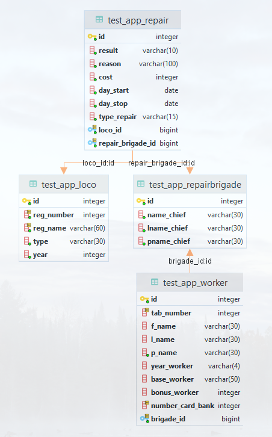

# Модель данных
## UML

## Описание
### Рабочие
```finalapp_Worker```

- ```id(int)``` Идентификатор рабочего
- ```tab_number(int)``` Табельный номер рабочего
- ```f_name(varchar(30))``` Имя рабочего
- ```l_name(varchar(30))``` Фамилия рабочего
- ```p_name(varchar(30))``` Отчество рабочего
- ```year_worker(int)``` Год рождения рабочего
- ```base_worker(varchar(50))``` Образование рабочего
- ```bonus_worker(int)``` Премия рабочего
- ```number_card_bank(int)``` Зарплатная карта рабочего
- ```brigade(int)``` Идентификатор бригады

### Ремонты
```finalapp_Repair```

- ```id(int)``` Идентификатор ремонта
- ```result(varchar(10))``` Результат ремонта
- ```reason(varchar(100))``` Причина ремонта
- ```cost(int)``` Стоимость ремонта
- ```day_start(date)``` Начало ремонта
- ```day_stop(date)``` Окончание ремонта
- ```type_repair(varchar(15))``` Тип ремонта
- ```repair_brigade(int)``` Идентификтор бригады
- ```loco(int)``` Идентификатор локомотива

### Локомотивы
```finalapp_Loco```

- ```id(int)``` Идентификатор локомотива
- ```reg_number(int)``` Номер локомотива
- ```reg_name(varchar(60))``` Название локомотива
- ```type(varchar(30))``` Тип локомотива
- ```year(int)``` Год создания


### Бригады
```finalapp_Brigade```

- ```id(int)``` Идентификатор бригады
- ```name_chief(varchar(30))``` Имя бригадира
- ```lname_chief(varchar(30))``` Фамилия бригадира
- ```pname_chief(varchar(30))``` Отчество бригадира
