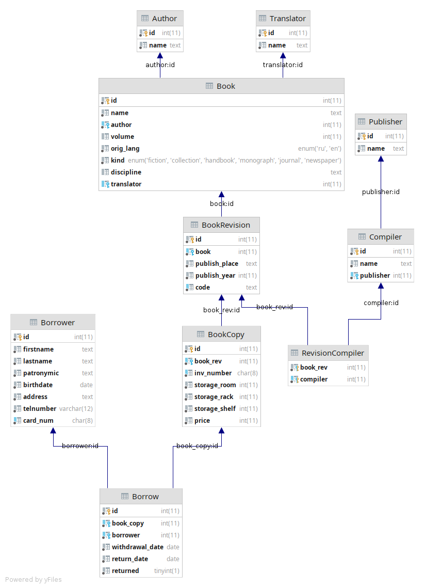

# Модель данных

## ER диаграмма

## Author
Автор.

## Translator
Переводчик. Указывается для книг, язык оригинала которых не русский.

## Publisher
Издатель.

## Book
Книга. Имеет язык оригинала, вид и область знания. Может иметь номер тома.

## BookRevision
Издание книги. Имеет код, место и год выпуска.

## BookCopy
Экземпляр книги. Имеет цену, инвентаризационный номер и место хранения.

## Compiler
Составитель. Работает в издательстве.

## RevisionCompiler
Связь многие-ко-многим для составителя и издания.

## Borrower
Читатель. Имеет стандартные поля для человека и номер читательского билета.

## Borrow
Факт выдачи книги читателю. Содержит дату выдачи и возврата и была ли книга возвращена.
