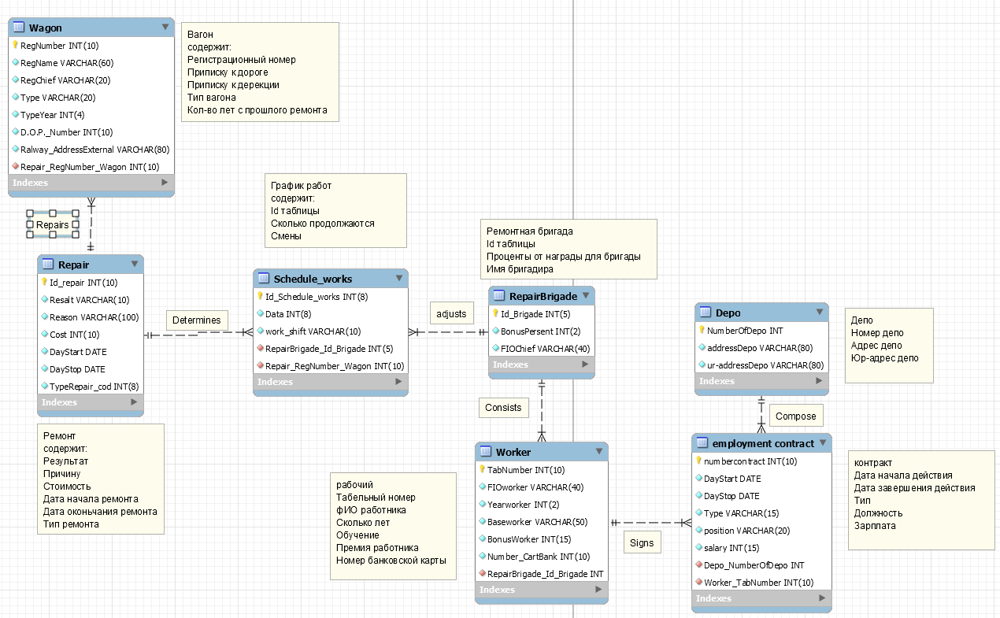

#Модель данных
```python
# Таблица Вагон, хранит в себе указатели к чему приписан вагон,
# уникальное имя и код, а также тип и счётчик лет с последнего тех-обслуживания
class Wagon(models.Model):
    reg_number = models.IntegerField(unique=True)
    reg_name = models.CharField(max_length=60, unique=True)
    reg_chief = models.CharField(max_length=20, unique=True)
    type = models.CharField(max_length=30)
    type_year = models.IntegerField()
    dop_number = models.IntegerField()
    ralway_addressExternal = models.CharField(max_length=80)

    def __str__(self):
        return "{} {} {} {} {} {}".format(self.reg_number, self.reg_name, self.reg_chief, self.type, self.type_year,
                                          self.dop_number)

# Таблица Ремонтная бригада 
# содержит фио бригадира, процент награды на бригаду за ремонт
class RepairBrigade(models.Model):
    bonus_persent = models.IntegerField()
    fio_chief = models.CharField(max_length=30)

# Таблица График работ
# содержит сколько длиться смена, смены
class Schedule_works(models.Model):
    data = models.IntegerField()
    work_shift = models.CharField(max_length=10)
    repair_brigade = models.ForeignKey(RepairBrigade, on_delete=models.CASCADE)

# Таблица Ремонт
# содержит причину, результат, стоимость, начало и конец ремонта, а также что ремонтировалось
class Repair(models.Model):
    resalt = models.CharField(max_length=10)
    reason = models.CharField(max_length=100)
    cost = models.IntegerField()
    day_start = models.DateTimeField()
    day_stop = models.DateTimeField()
    type_repair = models.CharField(max_length=15)
    schedule = models.ForeignKey(Schedule_works, default=1, on_delete=models.CASCADE)
    wagon = models.ForeignKey(Wagon, on_delete=models.CASCADE)

    def __str__(self):
        return "{} {} {} {} {} {} {}".format(self.resalt, self.reason, self.cost, self.day_start, self.day_stop,
                                             self.type_repair, self.schedule)

# Таблица Рабочий
# содержит табельный номер, фио, возраст, образование, номер карточки, в каких бригадах состоит
# а также имя и пароль от аккаунта
class Worker(AbstractUser):
    REQUIRED_FIELDS = []
    tab_number = models.IntegerField(unique=True, null=True)
    fio_worker = models.CharField(max_length=30, null=True)
    year_worker = models.IntegerField(null=True)
    base_worker = models.CharField(max_length=50, null=True)
    bonus_worker = models.IntegerField(default=5, null=True)
    number_cart_bank = models.IntegerField(unique=True, null=True)
    brigade = models.ManyToManyField(RepairBrigade, default=1, related_name='workers', null=True)

    def __str__(self):
        return "{} {} {} {} {} {} {} {}".format(self.username, self.password, self.tab_number, self.fio_worker,
                                                self.year_worker, self.base_worker,
                                                self.bonus_worker, self.number_cart_bank)

# Таблица Депо
# содержит адрес и юр-адрес депо
class Depo(models.Model):
    address_depo = models.CharField(max_length=80, unique=True)
    ur_address_depo = models.CharField(max_length=80, unique=True)

# Таблица Контракт
# содержит тип, начало и конец действия контракта, должность, зарплату работника
class employment_contract(models.Model):
    day_start = models.DateTimeField()
    day_stop = models.DateTimeField()
    type = models.CharField(max_length=15)
    position = models.CharField(max_length=20)
    salary = models.IntegerField()
    worker = models.ForeignKey(Worker, on_delete=models.CASCADE)
    depo = models.ForeignKey(Depo, on_delete=models.CASCADE)
```
