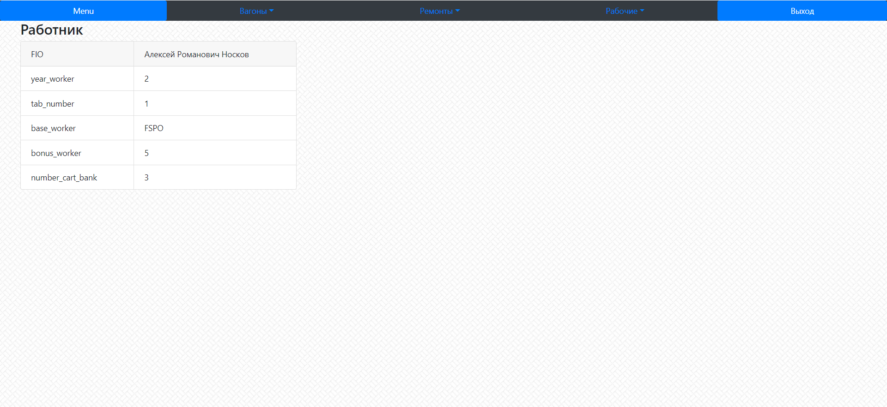

Выводит меню

**URL** : `worker/<int:pk>/detail/`

**Method** : `GET`

**Auth required** : YES

**Permissions required** : NO

**Data constraints** : `{}`

## Success Responses

Также с wagon/<int:pk>/detail/ и repair/<int:pk>/detail/