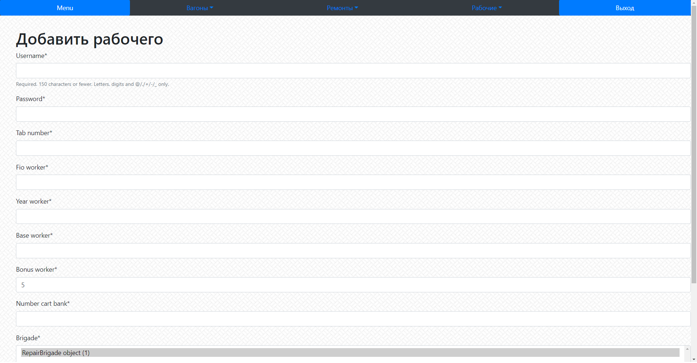

Выводит интерфейс для добавления данных про рабочего

**URL** : `worker/add/`

**Method** : `GET`

**Auth required** : YES

**Permissions required** : YES

**Data constraints** : `{}`

## Success Responses

Также с wagon/add/ и repair/add/
