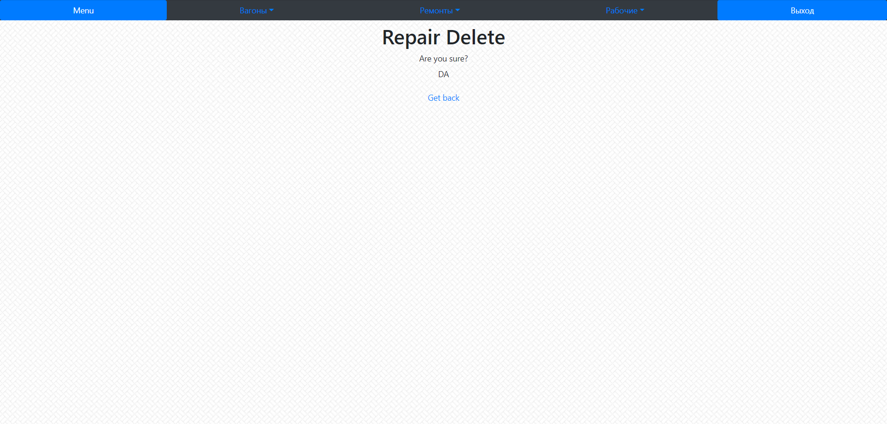

Выводит интерфейс для удаления рабочего

**URL** : `repair/<int:pk>/delete/`

**Method** : `GET`

**Auth required** : YES

**Permissions required** : YES

**Data constraints** : `{}`

## Success Responses

Также с wagon/<int:pk>/delete/ и worker/<int:pk>/delete/
