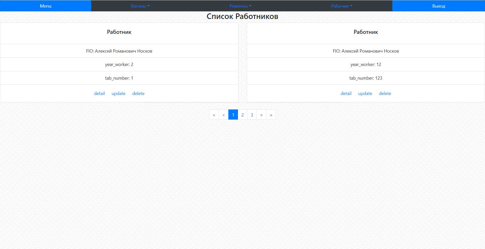

Выводит информацию обо всех рабочих

**URL** : `/worker/list/`

**Method** : `GET`

**Auth required** : YES

**Permissions required** : YES

**Data constraints** : `{}`

## Success Responses

Также с /wagon/list/ и /repair/list/ за исключением требования к разрешению на просмотр
