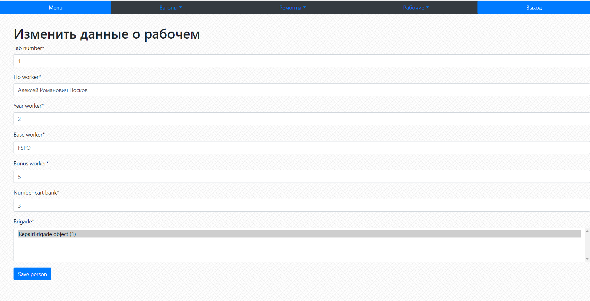

Выводит интерфейс для обновления данных о рабочем

**URL** : `worker/<int:pk>/update/`

**Method** : `GET`

**Auth required** : YES

**Permissions required** : YES

**Data constraints** : `{}`

## Success Responses

Также с wagon/<int:pk>/update/ и repair/<int:pk>/update/
