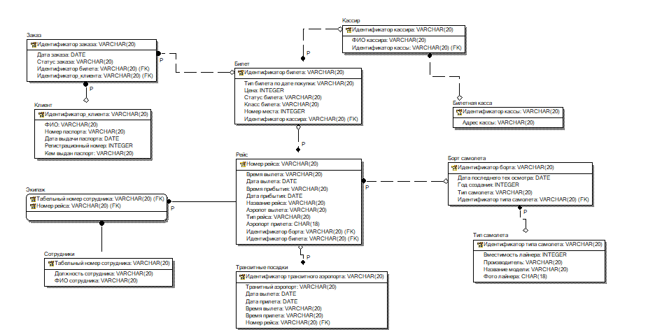

# Продажа авиабилетов
Касса авиакомпании занимается продажей
билетов на предстоящие рейсы. В билете указывается номер и название
рейса, а также все остальные необходимые для пассажира данные: дата
и время вылета, прибытия,
номер места и класс (бизнес, экономический). Цена билета зависит от
рейса, лайнера, класса, а также от времени покупки билета – иногда
авиакомпании делают скидки купившим билет более чем за месяц или
на “горящие рейсы” – все зависит от желания компании. Билеты
продаются только совершеннолетним гражданам при предъявлении
паспорта. У авиакомпании обычно имеется несколько касс,
расположенных в разных концах города, поэтому обязательно
необходимо учитывать номер кассы, в которой был продан билет, во
избежание недоразумений при сдаче или обмене билета.

СУБД: PostgreSQL

