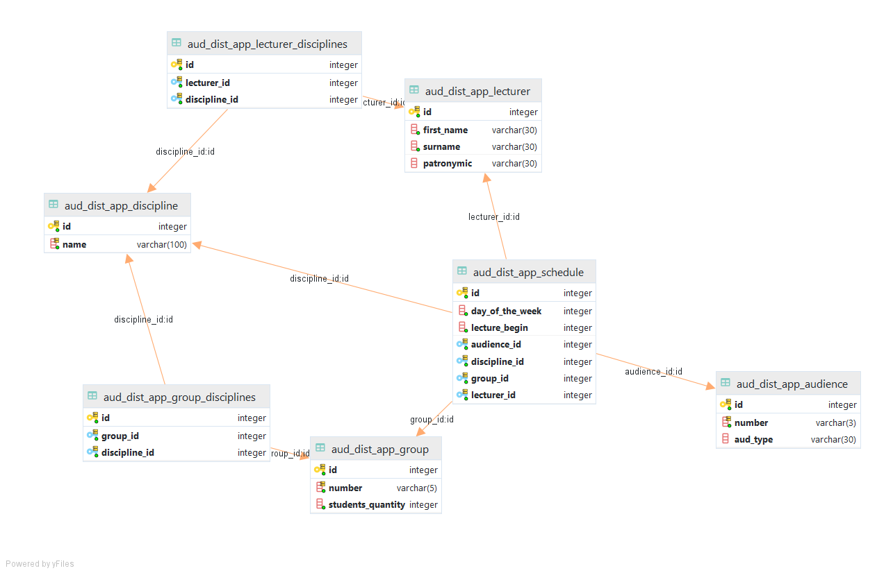

# Модель данных

## UML

## Описание

### Расписание 

`aud_dist_app_schedule`

* `id (int)` Идентификатор
* `day_of_the_week (int)` Номер дня недели
* `lecture_begin (int)` Номер пары
* `audience_id (int)` Идентификатор аудитории
* `discipline_id (int)` Идентификатор дисциплины
* `group_id (int)` Идентификатор группы 
* `lecturer_id (int)` Идентификатор преподавателя

### Преподаватели 

`aud_dist_app_lecturer`

* `id (int)` Идентификатор
* `first_name (varchar(30))` Имя
* `surname (varchar(30))` Фамилия
* `patronymic (varchar(30))` Отчество

### Преподаватели - Дисциплины (ассоц. сущность)

`aud_dist_app_lecturer_disciplines`

* `id (int)` Идентификатор
* `lecturer_id (int)` Идентификатор преподавателя
* `discipline_id (int)` Идентификатор дисциплины

### Группы

`aud_dist_app_group`

* `id (int)` Идентификатор
* `number (varchar(5))` Номер группы
* `students_quantity (int)` Количество студентов

### Группы - Дисциплины (ассоц. сущность)

`aud_dist_app_group_disciplines`

* `id (int)` Идентификатор
* `group_id (int)` Идентификатор группы 
* `discipline_id (int)` Идентификатор дисциплины

### Дисциплины

`aud_dist_app_discipline`

* `id (int)` Идентификатор
* `name (varchar(100))` Наименование дисциплины 

### Аудитории

`aud_dist_app_audience`

* `id (int)` Идентификатор
* `number (varchar(3))` Номер аудитории
* `aud_type (varchar(30))` Тип аудитории
