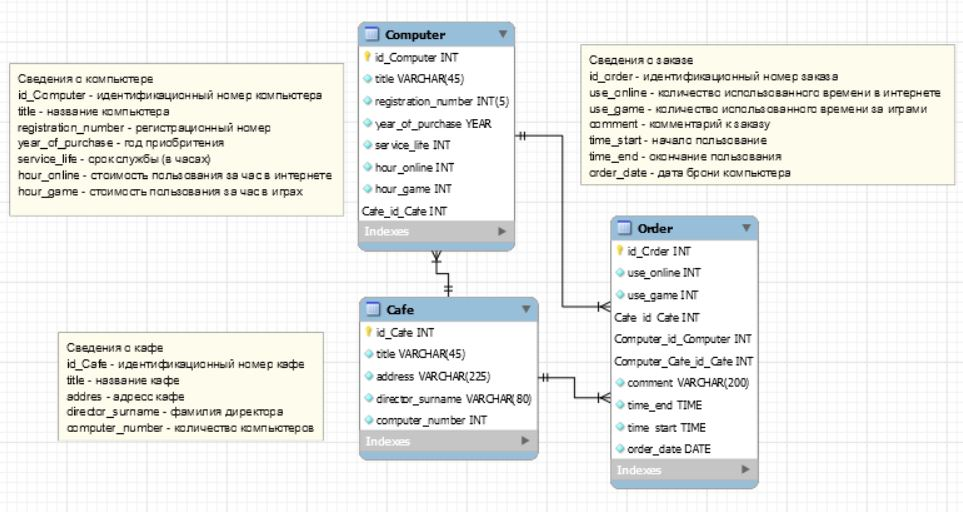
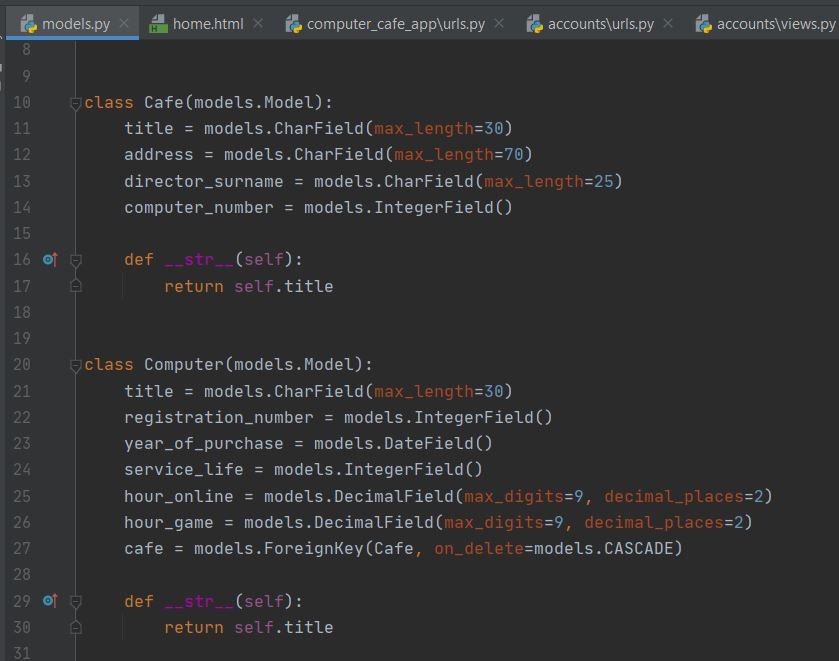
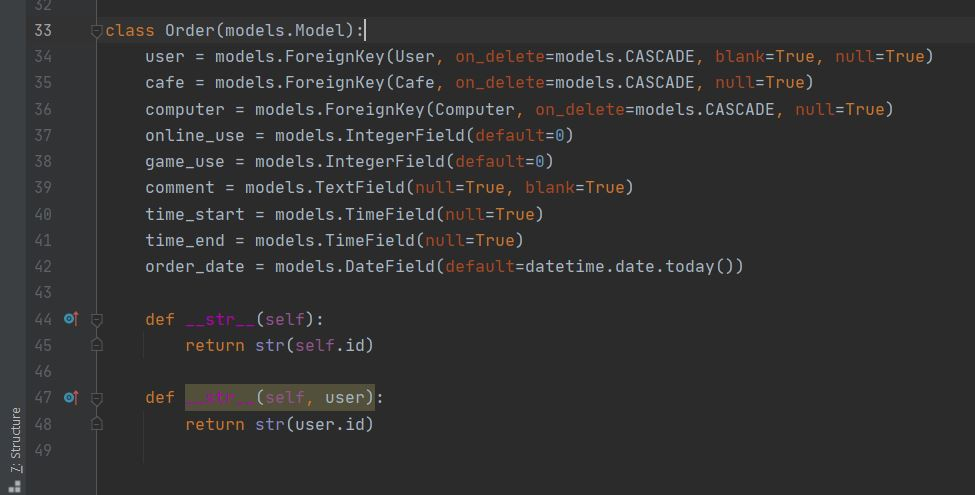

## «Компьютерное кафе»

Центр «КомпьютерСервис» имеет в своем распоряжении сеть компьютерных кафе, 
в которых установлены компьютеры разных марок, используемые либо для игр, 
либо для выхода в Интернет. 

Каждое кафе имеет свой круг сотрудников и набор компьютеров, цены на которые
установлены в двух категориях: для игры и для выхода в Интернет, цена 
устанавливается почасовая. 

Каждый компьютер имеет определенный срок службы, после чего он подлежит списанию. 
В конце рабочего дня использование компьютера фиксируется датой, количеством проданных 
билетов по каждой из категорий.
 
Центр «КомпьютерСервис» должен иметь сведения: 
	- о компьютерном кафе: 
		- название кафе, 
		- адрес кафе, 
		- фамилия директора, 
		- количество компьютеров; 
	- о компьютерах: 
		- название компьютера, 
		- регистрационный номер компьютера, 
		- год приобретения, срок службы (в часах), 
		- стоимость одного часа времени использования 
		  по категориям (Интернет, игра), название кафе; 

Модель БД:

Модели django:

