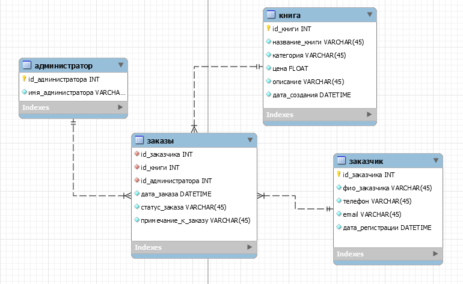
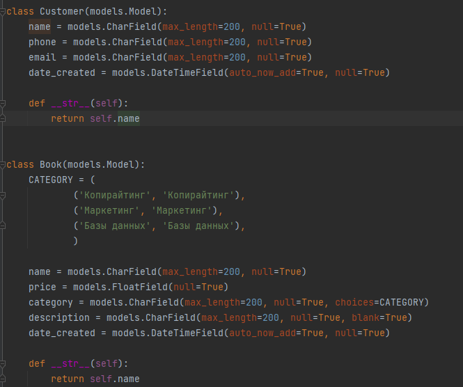
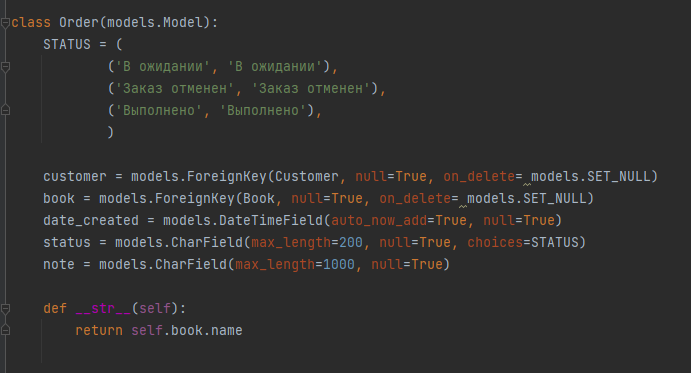

## Система обслуживания магазина "Книги"

Магазин "Книги" – магазин, который занимается продажами книг
различных тематик. Функционал сайта для пользователя: просмотр списка книг,
поиск нужной книги, просмотр всех заказов, в том числе 
сортировка по определенному заказчику. Администратор же может добавлять заказы и
книги, а также редактировать и удалять их.
Книги имеют название, категорию, цену, описание, а также дату добавления
в базу. Администратор имеет следующие данные о заказчиках: ФИО, телефон
email, а также дату регистрации.

Модель базы данных:

Модели django:

