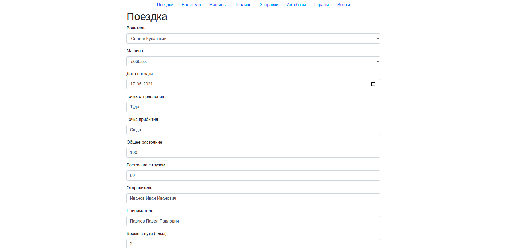
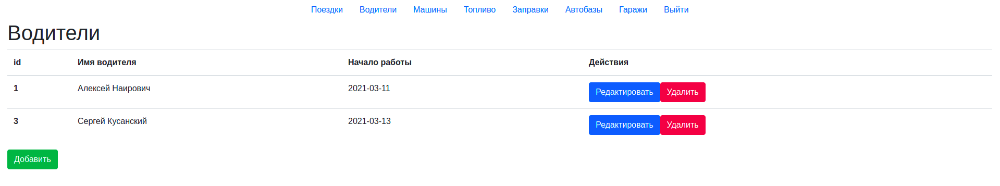
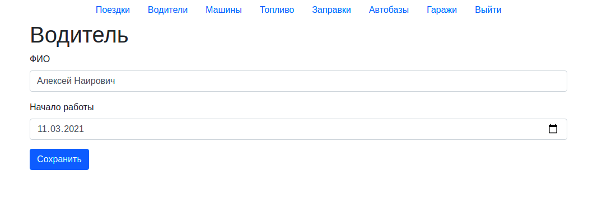
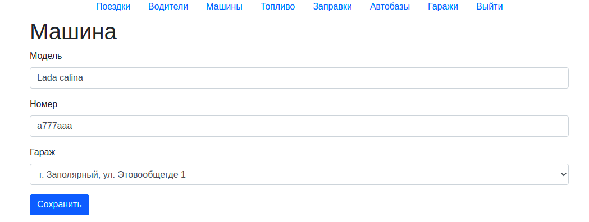
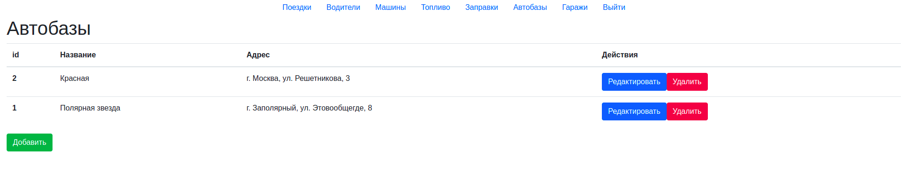
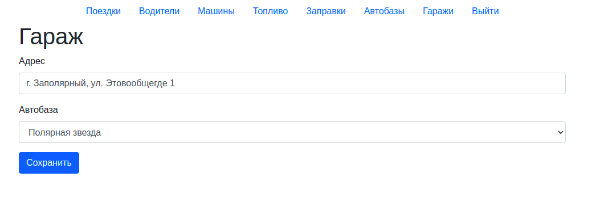

# Endpoints

## ``` /drivers/ ```

Методы:

* get - получить список водителей
* post - создать водителя (name, exp_start)


## ``` /drivers/:id/ ```
Методы:

* get - получить водителя
* put - изменить водителя (name, exp_start)
* patch - изменить водителя (name, exp_start) - опционально
* delete - удалить водителя


## ``` /motor-depots/ ```
Методы:

* get - получить список автобаз
* post - создать автобазу (name, address)


## ``` /motor-depots/:id/ ```
Методы:

* get - получить автобазу
* put - изменить автобазу (name, address)
* patch - изменить автобазу (name, address) - опционально
* delete - удалить автобазу


## ``` /garages/ ```
Методы:

* get - получить список гаражей
* post - создать гараж (address, motor_depot_id)

## ``` /garages/:id/ ```
Методы:

* get - получить гараж
* put - изменить гараж (address, motor_depot_id)
* patch - изменить гараж (address, motor_depot_id) - опционально
* delete - удалить гараж


## ``` /cars/ ```
Методы:

* get - получить список машин
* post - создать машину (car_model, reg_number, garage_id, refuels)


## ``` /cars/:id/ ```
Методы:

* get - получить машину
* put - изменить машину (car_model, reg_number, garage_id, refuels)
* patch - изменить машину (car_model, reg_number, garage_id, refuels) - опционально
* delete - удалить машину


## ``` /fuels/ ```
Методы:

* get - получить список топлива
* post - создать топливо (fuel_name, liter)


## ``` /fuels/:id/ ```
Методы:

* get - получить топливо
* put - изменить топливо (fuel_name, liter)
* patch - изменить топливо (fuel_name, liter) - опционально
* delete - удалить топливо


## ``` /waybills/ ```
Методы:

* get - получить список поездок
* post - создать поездку (id_car, id_driver, trip_date, point_of_loading, point_of_unloading, mileage_total, mileage_cargo, consignor, consignee, order_time)

## ``` /waybills/:id/ ```
Методы:

* get - получить поездку
* put - изменить поездку (id_car, id_driver, trip_date, point_of_loading, point_of_unloading, mileage_total, mileage_cargo, consignor, consignee, order_time)
* delete - удалить поездку


## ``` /refuels/ ```
Методы:

* get - получить список заправок
* post - создать заправку (car_id, id_fuel, liters)


## ``` /refuels/:id/ ```
Методы:

* get - получить заправку
* put - изменить заправку (car_id, id_fuel, liters)
* delete - удалить заправку

