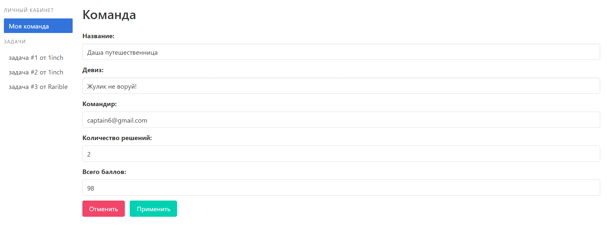
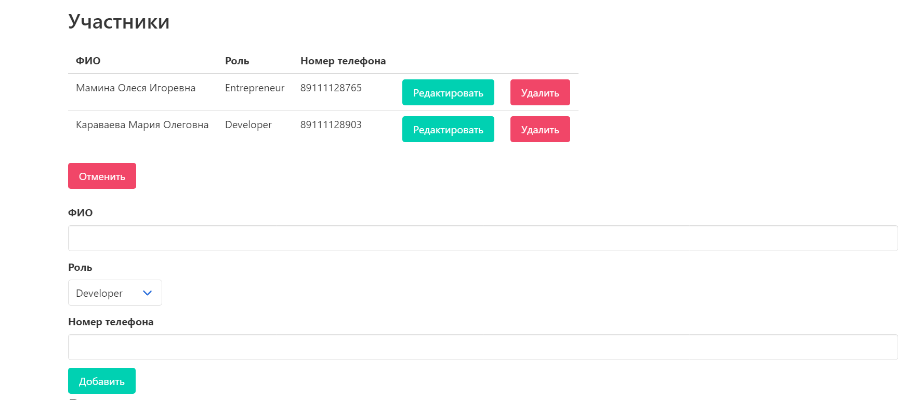
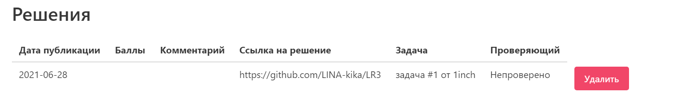
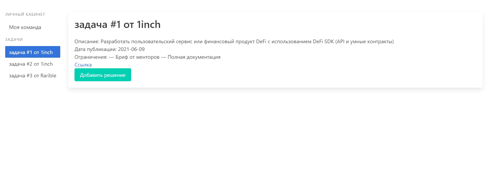
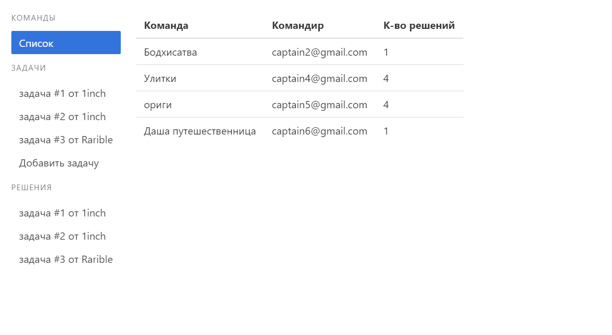
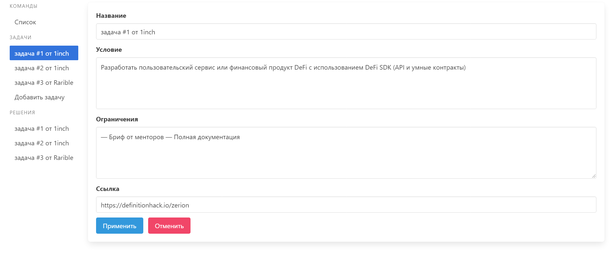
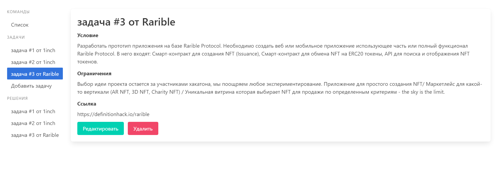
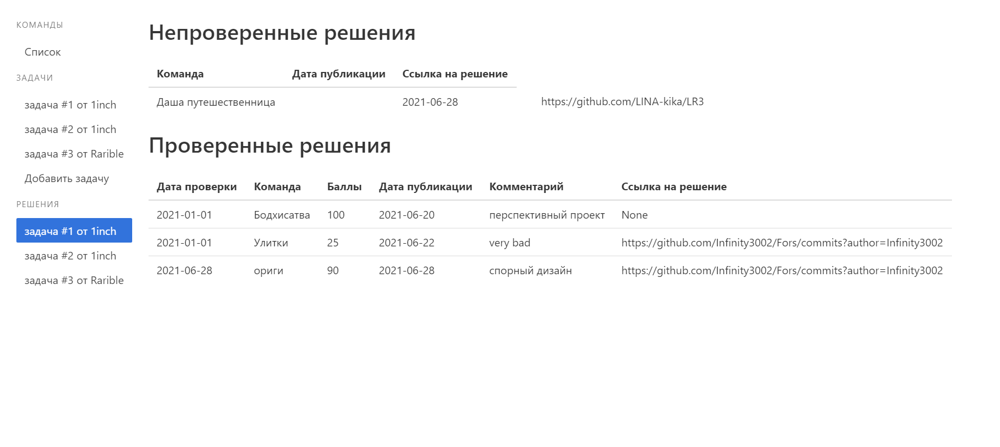
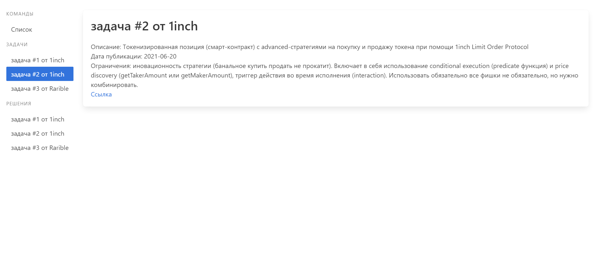
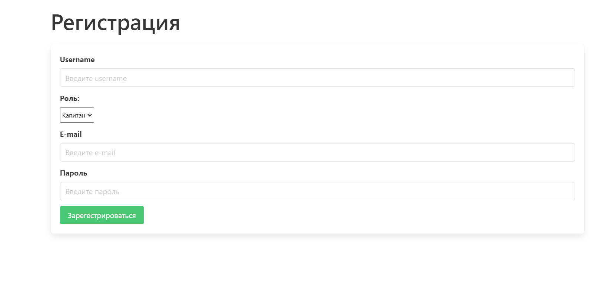

# Sitemap

- `hack/index/` - главная страница

### Роль: капитан

- Личный кабинет
  

  - Изменение информации о команде
    
      
    - Изменение информации об участниках
      
        
    - Добавление участника в команду
      
        
    - Удаление решения
      
    
- Просмотр задачи
  
    - Создание решения
      
  
### Роль: администратор
- Список команд
  
    
- Задачи
  
    - Добавление задачи
    
      
    - Редактирование задачи
      
        
    - Удаление задачи
      
  
- Решения
  
  
### Роль: жюри
- Список команд
  
    
    - Задачи
      

    - Решения
      
        - Проверка решений
          

        - Редактирование проверенных решений
          

- `hack/signup/` - страница регистрации пользователя

  

- `hack/login/` - страница входа

  

