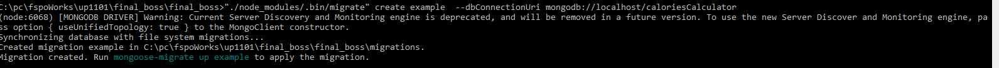
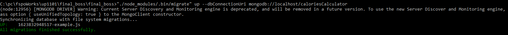
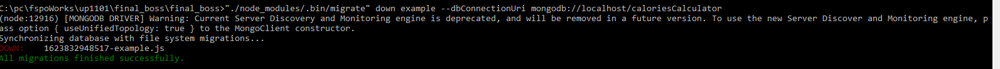

# Calories calculator project

## MONGOOSE based migrations

### 1. Инструмент

[migrate-mongoose](https://www.npmjs.com/package/migrate-mongoose)

### 2. Пример создания миграции

```bash
"./node_modules/.bin/migrate" create example  --dbConnectionUri mongodb://localhost/caloriesCalculator
```



### 3. Папочная структура миграций

example: ``` ./migrations/1623832948517-example.js ```

### 3. Файл миграции

```js
/**
 * Make any changes you need to make to the database here
 */
async function up () {
  await new Promise((resolve, reject) => {
    setTimeout(()=> { resolve('upped'); }, 3000);
  });
}

/**
 * Make any changes that UNDO the up function side effects here (if possible)
 */
async function down () {
  await new Promise((resolve, reject) => {
    setTimeout(()=> { resolve('downed'); }, 3000);
  });
}

module.exports = { up, down };

```

### 3. Применение миграции

```bash
"./node_modules/.bin/migrate" up --dbConnectionUri mongodb://localhost/caloriesCalculator
```



### 3. Откат миграции

```bash
"./node_modules/.bin/migrate" down example --dbConnectionUri mongodb://localhost/caloriesCalculator
```

