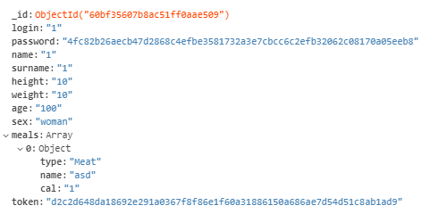

# Calories calculator project

## MONGO DB Model

### 1. Пример элемента коллекции

### 2. Описание коллекции

_id: ObjectId - генерируемый Mongo случайный id

login: string - логин пользователя

password: string - засекреченный с помощью sha-256 пароль пользователя

name: string - имя пользователя на сайте

surname: string - фамилия пользователя на сайте

height: int - рост пользователя

weight: int - вес пользователя

age: int - возраст пользователя

sex: string - пол пользователя

meals: array - массив пользовательских блюд

meals.meal: object - объект пользовательского блюда

meals.meal.type: string - тип пользовательского блюда

meals.meal.name: string - название пользовательского блюда

meals.meal.cal: int - калорийность пользовательского блюда

token: string - сгенерированный sha-256 токен авторизации пользователя
